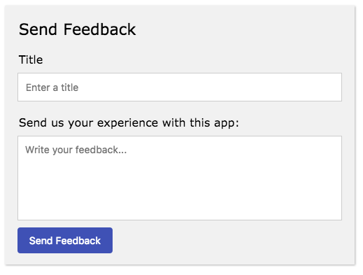

# send-feedback

This [electron-element](https://github.com/electron-elements/electron-elements#electron-elements) can be used to 
send feedback from an electron app to a website. Currently this works well for reporting 
issue to github's issue tracker, or any website that could accept user input sent from the app

## Install

```bash
npm i --save @electron-elements/send-feedback
```

## Usage

Basic Usage:
```javascript
const SendFeedback = require('@electron-elements/send-feedback');
customElements.define('send-feedback', SendFeedback);

const sendFeedback = document.createElement('send-feedback');
document.body.appendChild(sendFeedback);
```

This will have basic UI, ready to go see demo app by running `npm i && npm start`. 
You just need to configure a reporter to use and done. You now have send feedback 
functionality in your app. And once you have time you can totally modify the whole element's
css and text.

The default design of this element:
<p align="center">
  
</p>

See the [docs for usage and documentation to customize your send feedback element.](/docs)

Do you have a electron element you want to add to this repo? 
If so follow this guide at [electron-elements repo](https://github.com/electron-elements/electron-elements/blob/master/guides/add-an-electron-element-to-org.md)
